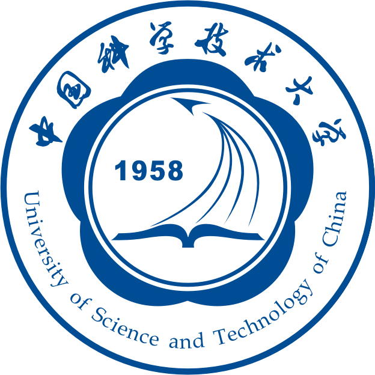

## About Me

I am an undergraduate student majoring in Cyber Science and Technology at the University of Science and Technology of China (USTC). Previously, I have conducted research in Deepfake Detection and LLM Unlearning. My current research interests focus on Mechanistic Interpretability of Large Language Models. 

## Research Interests

- **LLM Unlearning:** Investigated methods to evaluate unlearning effectiveness and model utility using Information Theory (e.g., Shannon Entropy) to balance data removal and capability retention.
- **Mechanistic Interpretability:** Exploring the internal mechanics of LLMs using tools like Sparse Autoencoders (SAEs) to understand how knowledge is stored and how models perform reasoning.

## Education & Experience

  

    
  

  

    <strong><a href="https://en.ustc.edu.cn/">USTC</a></strong> 
    B.S. in Cyber Science and Technology, 2023 – present
  

## News

- **[Aug. 2025]** Our project, 'LiteGuard: A Lightweight Deepfake Detection APP Based on Efficient Single-Frame Image and Temporal Residual Analysis,' won the Second Prize in the 18th National University Student Information Security Contest

## Selected Awards
  - **[Jan. 2026]** Yanbao Scholarship
  - **[Sep. 2025]** National Encouragement Scholarship
  - **[Nov. 2025]** Soong Ching Ling Future Grant
  - **[Aug. 2025]** Second Prize, the 18th National University Student Information Security Contest
  - **[Nov. 2024]** Silver Medal, Outstanding Student Scholarship
  - **[Nov. 2023]** Bronze Medal, Outstanding Student Scholarship


